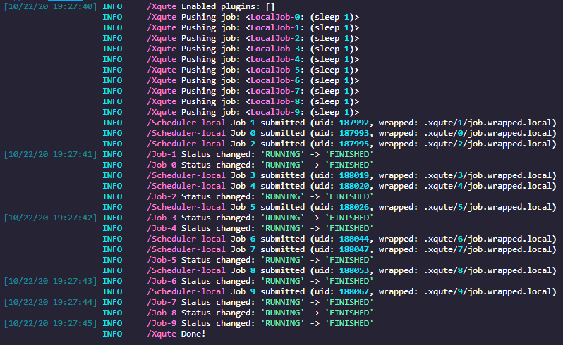

# xqute

A job management system for python

## Features

- Written in async
- Plugin system
- Scheduler adaptor
- Job retrying/pipeline halting when failed

## Installation

```
pip install xqute
```

## A toy example
```python
import asyncio
from xqute import Xqute

async def main():
    # 3 jobs allowed to run at the same time
    xqute = Xqute(scheduler_forks=3)
    for _ in range(10):
        await xqute.put('sleep 1')
    await xqute.run_until_complete()

if __name__ == '__main__':
    asyncio.run(main())
```




## API
https://pwwang.github.io/xqute/

## Usage

### Xqute object

An xqute is initialized by:
```python
xqute = Xqute(...)
```
Available arguments are:

- scheduler: The scheduler class or name
- plugins: The plugins to enable/disable for this session
- job_metadir: The job meta directory (Default: `./.xqute/`)
- job_error_strategy: The strategy when there is error happened
- job_num_retries: Max number of retries when job_error_strategy is retry
- job_submission_batch: The number of consumers to submit jobs
- scheduler_forks: Max number of job forks
- **scheduler_opts: Additional keyword arguments for scheduler

Note that the producer must be initialized in an event loop.

To push a job into the queue:
```python
await xqute.put(['echo', 1])
```

### Using SGE scheduler
```python
xqute = Xqute(
    'sge',
    scheduler_forks=100,
    qsub='path to qsub',
    qdel='path to qdel',
    qstat='path to qstat',
    sge_q='1-day',  # or qsub_q='1-day'
    ...
)
```
Keyword-arguments with names starting with `sge_` will be interpreted as `qsub` options. `list` or `tuple` option values will be expanded. For example:
`sge_l=['h_vmem=2G', 'gpu=1']` will be expanded in wrapped script like this:
```shell
# ...

#$ -l h_vmem=2G
#$ -l gpu=1

# ...
```


### Using Slurm scheduler

```python
xqute = Xqute(
    'slurm',
    scheduler_forks=100,
    sbatch='path to sbatch',
    scancel='path to scancel',
    squeue='path to squeue',
    sbatch_partition='1-day',  # or slurm_partition='1-day'
    sbatch_time='01:00:00',
    ...
)
```

### Using ssh scheduler

```python
xqute = Xqute(
    'ssh',
    scheduler_forks=100,
    ssh='path to ssh',
    ssh_servers={
        "server1": {
            "user": ...,
            "port": 22,
            "keyfile": ...,
            # How long to keep the ssh connection alive
            "ctrl_persist": 600,
            # Where to store the control socket
            "ctrl_dir": "/tmp",
        },
        ...
    }
    ...
)
```

SSH servers must share the same filesystem and using keyfile authentication.

### Plugins

To write a plugin for `xqute`, you will need to implement the following hooks:

- `on_init(scheduler)`: Right after scheduler object is initialized
- `on_shutdown(scheduler, sig)`: When scheduler is shutting down
- `on_job_init(scheduler, job)`: When the job is initialized
- `on_job_queued(scheduler, job)`: When the job is queued
- `on_job_submitted(scheduler, job)`: When the job is submitted
- `on_job_killing(scheduler, job)`: When the job is being killed
- `on_job_killed(scheduler, job)`: When the job is killed
- `on_job_failed(scheduler, job)`: When the job is failed
- `on_job_succeeded(scheduler, job)`: When the job is succeeded

Note that all hooks are corotines except `on_init` and `on_shutdown`, that means you should also implement them as corotines (sync implementations are allowed but will be warned).

To implement a hook, you have to fetch the plugin manager:

```python
from simplug import Simplug
pm = Simplug('xqute')

# or
from xqute import simplug as pm
```

and then use the decorator `pm.impl`:

```python
@pm.impl
def on_init(scheduler):
    ...
```

### Implementing a scheduler

Currently there are only 2 builtin schedulers: `local` and `sge`.

One can implement a scheduler by subclassing the `Scheduler` abstract class. There are three abstract methods that have to be implemented in the subclass:

```python
from xqute import Scheduer

class MyScheduler(Scheduler):
    name = 'my'
    job_class: MyJob

    async def submit_job(self, job):
        """How to submit a job, return a unique id in the scheduler system
        (the pid for local scheduler for example)
        """

    async def kill_job(self, job):
        """How to kill a job"""

    async def job_is_running(self, job):
        """Check if a job is running"""
```

As you may see, we may also need to implement a job class before `MyScheduler`. The only abstract method to be implemented is `wrap_cmd`:
```python
from xqute import Job

class MyJob(Job):

    async def wrap_cmd(self, scheduler):
        ...
```

You have to use the trap command in the wrapped script to update job status, return code and clear the job id file.
