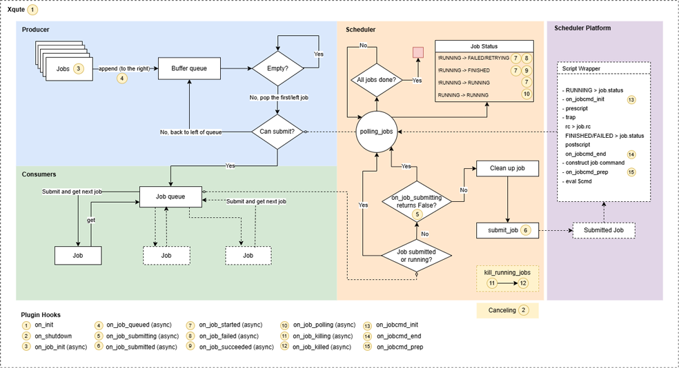

# xqute

A job management system for python

## Features

- Written in async
- Plugin system
- Scheduler adaptor
- Job retrying/pipeline halting when failed
- Support cloud working directory
- Support Google Batch Jobs scheduler

## Installation

```shell
pip install xqute
```

## A toy example

```python
import asyncio
from xqute import Xqute

async def main():
    # 3 jobs allowed to run at the same time
    xqute = Xqute(forks=3)
    for _ in range(10):
        await xqute.put('sleep 1')
    await xqute.run_until_complete()

if __name__ == '__main__':
    asyncio.run(main())
```


## API

<https://pwwang.github.io/xqute/>

## Usage

### Xqute object

An xqute is initialized by:

```python
xqute = Xqute(...)
```

Available arguments are:

- scheduler: The scheduler class or name
- plugins: The plugins to enable/disable for this session
- workdir: The job meta directory (Default: `./.xqute/`)
- forks: The number of jobs allowed to run at the same time
- error_strategy: The strategy when there is error happened
- num_retries: Max number of retries when job_error_strategy is retry
- submission_batch: The number of consumers to submit jobs
- scheduler_opts: Additional keyword arguments for scheduler
- jobname_prefix: The prefix of the job name

Note that the producer must be initialized in an event loop.

To push a job into the queue:

```python
await xqute.put(['echo', 1])
```

### Using SGE scheduler

```python
xqute = Xqute(
    'sge',
    forks=100,
    scheduler_opts=dict(
        qsub='path to qsub',
        qdel='path to qdel',
        qstat='path to qstat',
        q='1-day',  # or qsub_q='1-day'
    )
    ...
)
```

Keyword-arguments with names starting with `sge_` will be interpreted as `qsub` options. `list` or `tuple` option values will be expanded. For example:
`l=['h_vmem=2G', 'gpu=1']` will be expanded in wrapped script like this:

```shell
# ...

#$ -l h_vmem=2G
#$ -l gpu=1

# ...
```

### Using Slurm scheduler

```python
xqute = Xqute(
    'slurm',
    forks=100,
    scheduler_opts = {
        "sbatch": 'path to sbatch',
        "scancel": 'path to scancel',
        "squeue": 'path to squeue',
        "partition": '1-day',  # or partition='1-day'
        "time": '01:00:00',
        ...
    },
)
```

### Using ssh scheduler

```python
xqute = Xqute(
    'ssh',
    forks=100,
    scheduler_opts={
        "ssh": 'path to ssh',
        "servers": {
            "server1": {
                "user": ...,
                "port": 22,
                "keyfile": ...,
                # How long to keep the ssh connection alive
                "ctrl_persist": 600,
                # Where to store the control socket
                "ctrl_dir": "/tmp",
            },
            ...
        }
    },
    ...
)
```

SSH servers must share the same filesystem and using keyfile authentication.

### Plugins

To write a plugin for `xqute`, you will need to implement the following hooks:

- `def on_init(scheduler)`: Right after scheduler object is initialized
- `def on_shutdown(scheduler, sig)`: When scheduler is shutting down
- `async def on_job_init(scheduler, job)`: When the job is initialized
- `async def on_job_queued(scheduler, job)`: When the job is queued
- `async def on_job_submitted(scheduler, job)`: When the job is submitted
- `async def on_job_started(scheduler, job)`: When the job is started (when status changed to running)
- `async def on_job_polling(scheduler, job)`: When job status is being polled
- `async def on_job_killing(scheduler, job)`: When the job is being killed
- `async def on_job_killed(scheduler, job)`: When the job is killed
- `async def on_job_failed(scheduler, job)`: When the job is failed
- `async def on_job_succeeded(scheduler, job)`: When the job is succeeded
- `def on_jobcmd_init(scheduler, job) -> str`: When the job command wrapper script is initialized before the prescript is run. This will replace the placeholder `{jobcmd_init}` in the wrapper script.
- `def on_jobcmd_prep(scheduler, job) -> str`: When the job command is right about to run in the wrapper script. This will replace the placeholder `{jobcmd_prep}` in the wrapper script.
- `def on_jobcmd_end(scheduler, job) -> str`: When the job command wrapper script is about to end and after the postscript is run. This will replace the placeholder `{jobcmd_end}` in the wrapper script.

Note that all hooks are corotines except `on_init`, `on_shutdown` and `on_jobcmd_*`, that means you should also implement them as corotines (sync implementations are allowed but will be warned).

You may also check where the hooks are called in the following diagram:



To implement a hook, you have to fetch the plugin manager:

```python
from simplug import Simplug
pm = Simplug('xqute')

# or
from xqute import simplug as pm
```

and then use the decorator `pm.impl`:

```python
@pm.impl
def on_init(scheduler):
    ...
```

### Implementing a scheduler

Currently there are a few builtin schedulers: `local`, `slurm`, `gbatch` and `sge`.

One can implement a scheduler by subclassing the `Scheduler` abstract class. There are three abstract methods that have to be implemented in the subclass:

```python
from xqute import Scheduer


class MyScheduler(Scheduler):
    name = 'mysched'

    async def submit_job(self, job):
        """How to submit a job, return a unique id in the scheduler system
        (the pid for local scheduler for example)
        """

    async def kill_job(self, job):
        """How to kill a job"""

    async def job_is_running(self, job):
        """Check if a job is running"""
```
