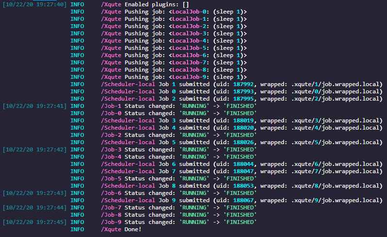
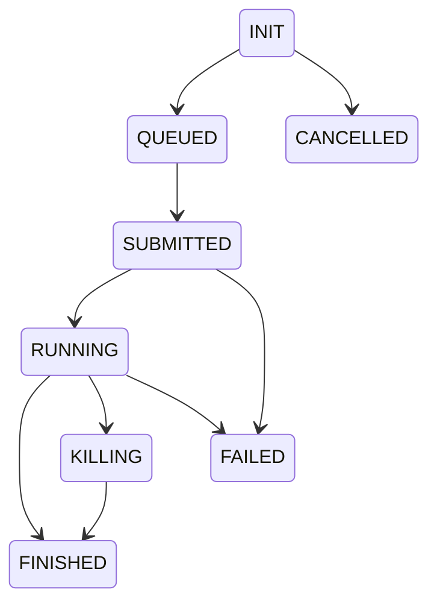

#  Xqute

**Async-first job management and scheduling framework for Python.** Xqute gives you a single, clean API to schedule, submit, monitor, and manage batch jobs across any backend — local processes, HPC clusters, cloud batch services, or containers.

---

## Why Xqute?

You're running a computational pipeline — hundreds or thousands of jobs. Each job might take minutes or hours. They need to fan out across a Slurm cluster, a pool of SSH servers, or a container farm. You need retries on failure, status tracking, and plugins for logging and notifications.

Xqute handles all of this so you can focus on your actual work — your commands.

- **One API, six backends** — write your pipeline once; swap `scheduler="local"` for `"slurm"`, `"sge"`, `"ssh"`, `"gbatch"`, or `"container"` when you're ready for production.
- **Resilient by design** — jobs self-report status through files on disk. Network hiccups and scheduler quirks won't lose your results.
- **Plays well with others** — plugin hooks for Slack, email, databases, and anything else you can think of.
- **Async all the way down** — built on `asyncio` + `uvloop`; thousands of concurrent jobs with minimal overhead.

## Install

```bash
pip install xqute
```

## 30-second example

```python
import asyncio
from xqute import Xqute

async def main():
    xqute = Xqute(forks=4)
    for i in range(20):
        await xqute.feed(["python", "train.py", str(i)])
    await xqute.run_until_complete()

asyncio.run(main())
```

<small>*20 models, 4 at a time. That's it.*</small>

## Feature tour

=== "Scheduler backends"

    Six schedulers ship with xqute. Each handles the nuances of its backend — you just set `scheduler="..."`:

    | Scheduler | Best for |
    |---|---|
    | `local` | Development, a single beefy machine |
    | `slurm` | Modern HPC / GPU clusters |
    | `sge` | Traditional Sun Grid Engine (university clusters) |
    | `ssh` | Pool of Linux servers behind SSH |
    | `gbatch` | Google Cloud Batch — auto-scaling cloud compute |
    | `container` | Docker, Podman, or Apptainer isolation |

    ```python
    xqute = Xqute(
        scheduler="slurm",
        forks=100,
        scheduler_opts={"partition": "gpu", "gres": "gpu:1"},
    )
    ```

=== "Error strategies"

    Two built-in strategies, plus per-job overrides:

    ```python
    # Retry up to 3 times (default)
    xqute = Xqute(error_strategy="retry", num_retries=3)

    # Or stop the world on first failure
    xqute = Xqute(error_strategy="halt")
    ```

    Per-job control:

    ```python
    await xqute.feed(["fragile-command"], num_retries=5)
    ```

=== "Plugin system"

    14 lifecycle hooks via `simplug`. Hook into any point in a job's lifecycle:

    | Phase | Hooks |
    |---|---|
    | Scheduler | `on_init`, `on_shutdown` |
    | Job lifecycle | `on_job_init`, `on_job_queued`, `on_job_submitting`, `on_job_submitted`, `on_job_started`, `on_job_polling`, `on_job_killing`, `on_job_killed`, `on_job_failed`, `on_job_succeeded` |
    | Bash wrapper | `on_jobcmd_init`, `on_jobcmd_prep`, `on_jobcmd_end` |

    ```python
    from xqute import simplug as pm

    @pm.impl
    async def on_job_succeeded(scheduler, job):
        print(f"Job {job.index} finished!")
    ```

=== "Daemon mode"

    Don't know all jobs upfront? Start in daemon mode and feed as you go:

    ```python
    await xqute.run_until_complete(keep_feeding=True)

    # Jobs arrive from a queue, an API, user input...
    for cmd in dynamic_source():
        await xqute.feed(cmd)

    await xqute.stop_feeding()
    ```

=== "Cloud storage"

    Work directories on cloud object storage — metadata lands where your compute can see it:

    ```python
    Xqute(workdir="gs://my-bucket/jobs", scheduler_opts={"mounted_workdir": "/mnt/gs"})
    ```

    Supports `gs://`, `az://`, and `s3://` paths. Files auto-download to a local cache on first access.

## Status lifecycle

Every job travels through a well-defined state machine. The wrapper script's `EXIT` trap writes status files — xqute's polling loop picks them up:



## What's inside

```
xqute/
├── xqute.py            # Main Xqute class — producer, consumer, polling loop
├── scheduler.py         # Abstract Scheduler base class
├── job.py               # Job data model
├── path.py              # SpecPath / MountedPath dual representation
├── plugin.py            # simplug lifecycle hook manager
├── defaults.py          # Constants, status enums, bash wrapper template
├── utils.py             # Logger and helpers
└── schedulers/
    ├── local_scheduler.py      # Local subprocess execution
    ├── slurm_scheduler.py      # Slurm sbatch integration
    ├── sge_scheduler.py        # SGE qsub integration
    ├── ssh_scheduler/          # SSH multi-server distribution
    ├── gbatch_scheduler.py     # Google Cloud Batch
    └── container_scheduler.py  # Docker/Podman/Apptainer
```

## Use cases

- **Bioinformatics pipelines** — fan out thousands of alignment/fastqc/variant-calling jobs across a cluster
- **ML hyperparameter sweeps** — train N models in parallel, each with different configs
- **Batch data processing** — process terabytes of log files, images, or documents
- **Scientific computing** — run simulations on HPC with queue management and retry logic
- **Cloud orchestration** — burst to Google Cloud Batch when on-prem capacity is maxed out

## Next pages

- [Quick Start](quickstart.md) — get running in minutes with every scheduler
- [User Guide](user-guide.md) — initialization, error handling, job output, best practices
- [Schedulers](schedulers.md) — full reference for all six backends
- [Plugins](plugins.md) — write your own lifecycle hooks
- [Advanced Usage](advanced.md) — custom schedulers, Airflow/Dask integration, perf tuning
- [API Reference](api/xqute.md) — auto-generated from source
