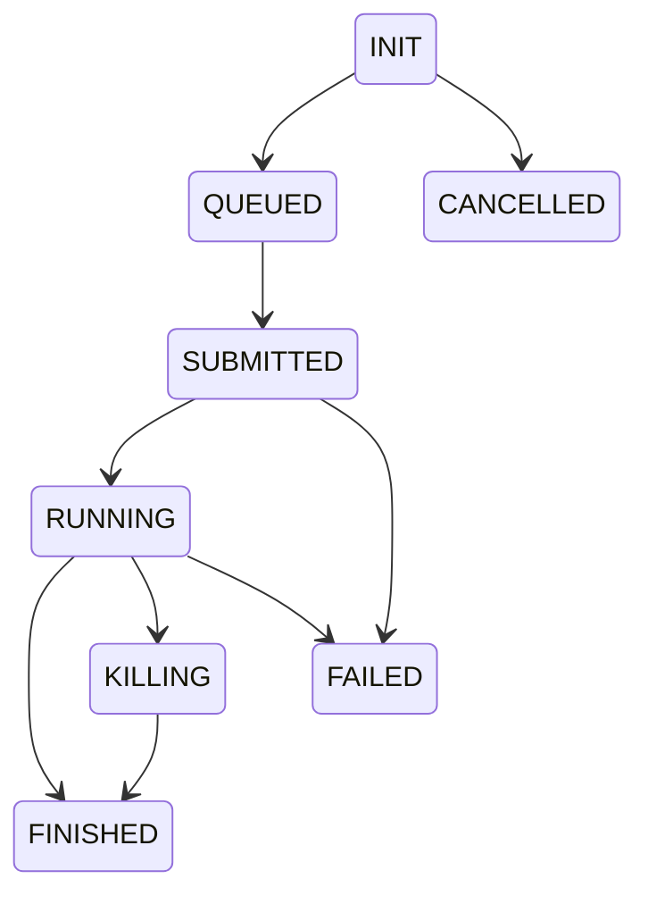

---
hide:
  - toc
  - navigation
---

<div class="hero-wrapper" markdown="0">
<div class="hero-bg"></div>
<div class="hero-content">


<div class="hero-tagline"><br />The async job scheduler that scales from your laptop to a 10,000‑core cluster</div>

<div class="hero-cta">
<a href="quickstart/" class="md-button md-button--primary hero-btn-primary">Quick Start →</a>
<code class="hero-install">$ pip install xqute</code>
</div>

<div class="hero-badges">


</div>

<div class="hero-schedulers">
<span>🖥️&nbsp;local</span>
<span>🎯&nbsp;slurm</span>
<span>📐&nbsp;sge</span>
<span>🔗&nbsp;ssh</span>
<span>☁️&nbsp;gbatch</span>
<span>📦&nbsp;container</span>
</div>

</div>
</div>

---

## Why xqute?

You're running a computational pipeline — hundreds or thousands of jobs. Each job might take minutes or hours. They need to fan out across a Slurm cluster, a pool of SSH servers, or a container farm. You need retries on failure, status tracking, and plugins for logging and notifications.

**Xqute handles all of this so you can focus on your actual work — your commands.**

<div class="feature-grid" markdown>

<div class="feature-card feature-purple" markdown>

#### :material-sync: Six Schedulers

Local, Slurm, SGE, SSH, Google Cloud Batch, Containers — **one API, swap the `scheduler` argument.**

</div>

<div class="feature-card feature-green" markdown>

#### :material-reload: Error Strategies

`retry` with configurable limits, `halt` on first failure, or `ignore` — **per-job overrides included.**

</div>

<div class="feature-card feature-amber" markdown>

#### :material-puzzle: Plugin System

14 lifecycle hooks via `simplug`. Slack, email, databases — **hook into any point.**

</div>

<div class="feature-card feature-sky" markdown>

#### :material-lightning-bolt: Async + uvloop

Built on `asyncio` with `uvloop`. **Thousands of concurrent jobs with minimal overhead.**

</div>

<div class="feature-card feature-rose" markdown>

#### :material-cloud: Cloud Storage

Workdirs on `gs://`, `az://`, or `s3://`. **Files auto-download to a local cache on access.**

</div>

<div class="feature-card feature-teal" markdown>

#### :material-timer: Job Timeouts

Per-job timeout via `coreutils timeout`. **No runaway jobs chewing your quota.**

</div>

</div>

---

## :material-rocket-launch: Scheduler backends

<div class="scheduler-strip" markdown>

<div class="sched-card" markdown>

### :material-laptop: Local

```python
xqute = Xqute(forks=4)
```

Subprocesses on the same machine. *Zero config.*

</div>

<div class="sched-card" markdown>

### :material-server: Slurm

```python
xqute = Xqute(
    scheduler="slurm",
    forks=100,
    scheduler_opts={
        "partition": "gpu",
        "gres": "gpu:1",
    },
)
```

Modern HPC clusters with `sbatch`.

</div>

<div class="sched-card" markdown>

### :material-grid: SGE

```python
xqute = Xqute(
    scheduler="sge",
    forks=100,
    scheduler_opts={
        "q": "1-day",
        "l": ["h_vmem=4G"],
    },
)
```

Traditional Grid Engine with `qsub`.

</div>

<div class="sched-card" markdown>

### :material-console-network: SSH

```python
xqute = Xqute(
    scheduler="ssh",
    forks=100,
    scheduler_opts={
        "servers": {
            "node1": {
                "user": "alice",
                "host": "node1.example.com",
                "keyfile": "...",
            },
        },
    },
)
```

Pool of Linux servers. Key-based auth.

</div>

<div class="sched-card" markdown>

### :material-google-cloud: GBatch

```python
xqute = Xqute(
    scheduler="gbatch",
    forks=100,
    scheduler_opts={
        "project": "my-gcp-project",
        "location": "us-central1",
    },
)
```

Auto-scaling Google Cloud Batch.

</div>

<div class="sched-card" markdown>

### :material-docker: Container

```python
xqute = Xqute(
    scheduler="container",
    forks=10,
    scheduler_opts={
        "image": "docker://python:3.12",
        "bin": "docker",
    },
)
```

Docker, Podman, or Apptainer.

</div>

</div>

---

## :material-play-circle: 30 seconds to your first pipeline

<div class="quickstart-block" markdown>

```python
import asyncio
from xqute import Xqute

async def main():
    xqute = Xqute(forks=4)
    for i in range(20):
        await xqute.feed(f"python train.py --model-id {i}")
    await xqute.run_until_complete()

asyncio.run(main())
```

<div class="quickstart-meta">

### That's it :tada:

**20 models, 4 at a time.** Add `scheduler="slurm"` and `forks=100` to hit the cluster. Switch to `keep_feeding=True` for daemon mode — feed jobs dynamically from a queue, an API, or user input.

[Full user guide →](user-guide.md)

</div>

</div>

---

## :material-state-machine: Job lifecycle

Every job travels through this state machine. The wrapper script's `EXIT` trap writes status files — xqute's polling loop reads them. No network round-trips for status.



---

## :material-file-tree: What's inside

<div class="tree-block" markdown>

```
xqute/
├── xqute.py            # Main Xqute class — producer, consumer, polling loop
├── scheduler.py         # Abstract Scheduler base class
├── job.py               # Job data model
├── path.py              # SpecPath / MountedPath dual representation
├── plugin.py            # simplug lifecycle hook manager
├── defaults.py          # Constants, status enums, bash wrapper template
├── utils.py             # Logger and helpers
└── schedulers/
    ├── local_scheduler.py      # Local subprocess execution
    ├── slurm_scheduler.py      # Slurm sbatch integration
    ├── sge_scheduler.py        # SGE qsub integration
    ├── ssh_scheduler/          # SSH multi-server distribution
    ├── gbatch_scheduler.py     # Google Cloud Batch
    └── container_scheduler.py  # Docker/Podman/Apptainer
```

</div>

## :material-bookshelf: Next pages

<div class="next-pages" markdown>

- [:material-rocket-launch: **Quick Start**](quickstart.md) — get running in minutes with every scheduler
- [:material-book-open-variant: **User Guide**](user-guide.md) — initialization, error handling, job output, best practices
- [:material-server: **Schedulers**](schedulers.md) — full reference for all six backends
- [:material-puzzle: **Plugins**](plugins.md) — write your own lifecycle hooks
- [:material-cog: **Advanced Usage**](advanced.md) — custom schedulers, Dask/Airflow integration, perf tuning
- [:material-code-braces: **API Reference**](mkapi/api/xqute) — auto-generated from source

</div>
